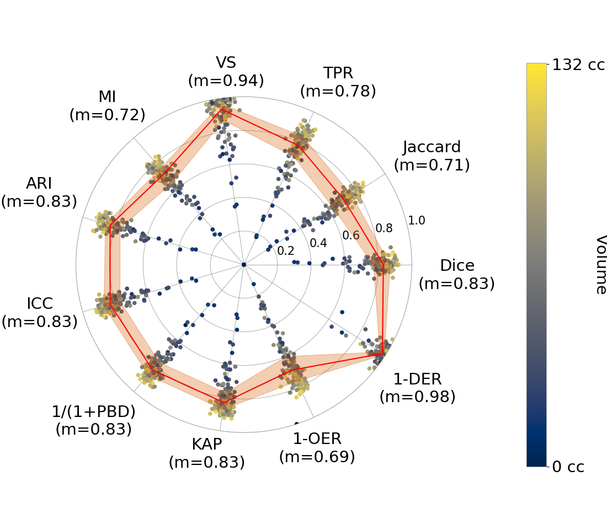

# EISRAD

eisrad.py ({e}valuation of {i}mage {s}egmentations using {rad}ar plots)) is a script for creating similarity metric radar charts for imaging data (NIfTI/nii[.gz] formatted)

(EISRAD - Ice circle; natural phenomenon appearing on the Vigala River in Estonia)

## Example usage
./eisrad.py -f segmentations.csv -o radar.png

## Description
input csv column format should be {automated_segmentation_file_path},{manual_segmentation_file_path}

output will be a png file
    send to '{your_output_file_name}.png'

enter './eisrad.py -h' or './eisrad.py --help' for descriptions of the optional parameters

Usage: eisrad.py [options]

Options:
  -h, --help            show this help message and exit
  -f FILE, --file=FILE  Input FILE
  -o FILE, --output=FILE
                        Output image FILE.png
  -m MIN, --min=MIN     Minimum colorbar value
  -M MAX, --max=MAX     Maximum colorbar value
  -L STRING, --label=STRING
                        Label for colorbar
  -l, --log             Plot logarithmic colorbar values
  -u STRING, --unit=STRING
                        Label for colorbar
  -d, --display         Display the output before saving as png
  -v, --verbose         verbose output
